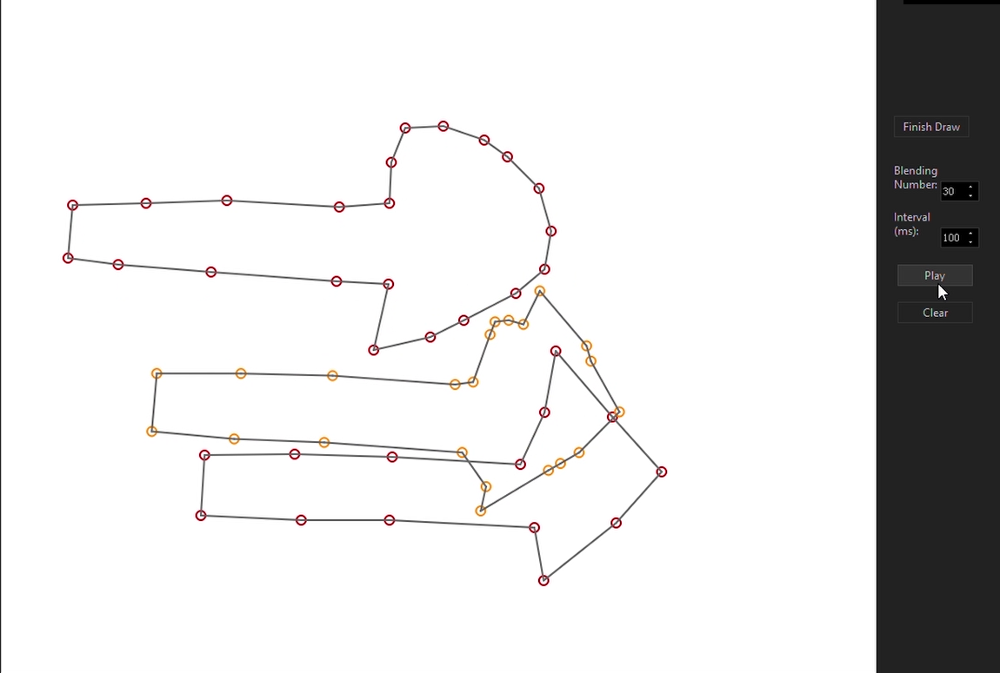
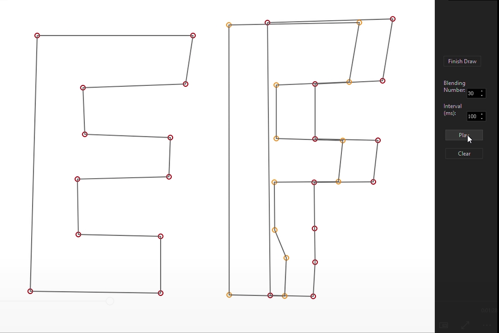
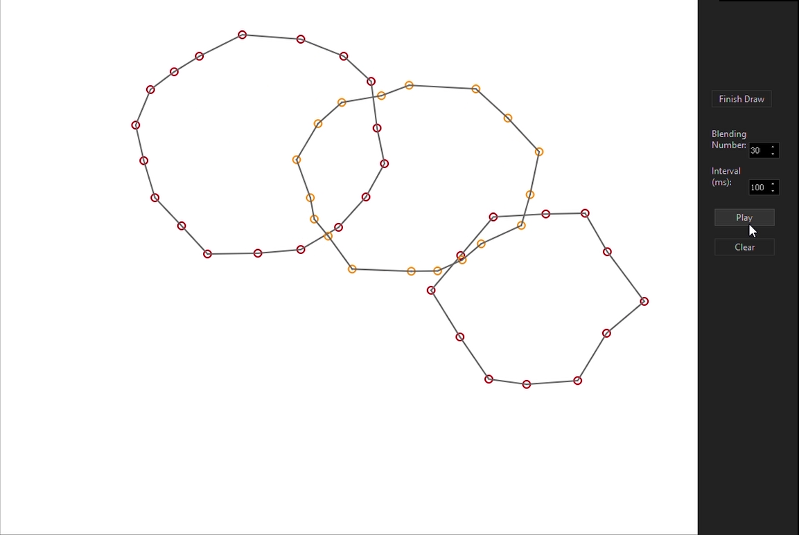
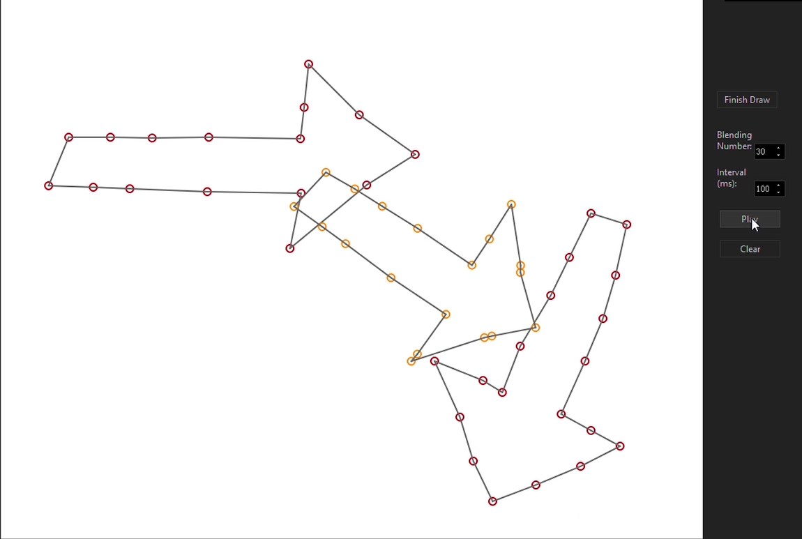

# Image-Warping-Fuzzy-Approach
- The realization of "A Fuzzy Approach to Digital Image Warping" in "Computer Animation". The link to the reference paper is [here]().

- A fuzzy mathematics-based method is used to establish the correspondence between the source polygon and the target polygon vertex and the interpolation between the vertices.

- Made with Qt Creator 4.6.2 in C++. 

- Video: https://youtu.be/rcIGJ6F8Tmw

## Demo

